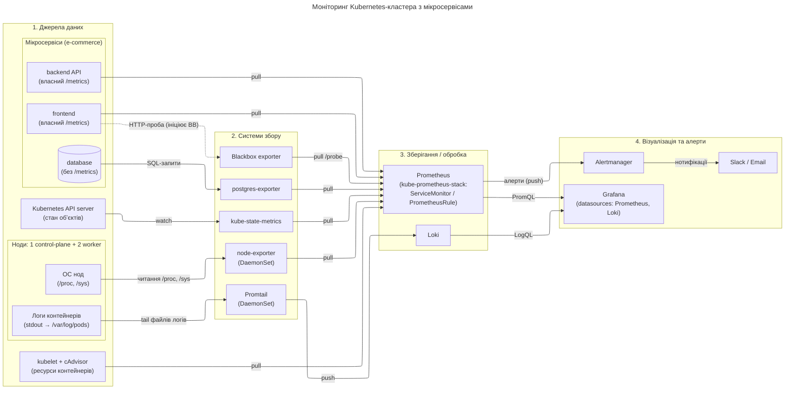

# Заняття 12 — Курсовий проєкт: моніторинг Kubernetes-кластера з мікросервісами

Дата захисту: 23 липня, 19:00

## Завдання

Обрати один із чотирьох варіантів проєкту та побудувати архітектурну діаграму
системи моніторингу, позначивши на ній:

- джерела даних (де виникають метрики/логи/трейси);
- системи збору (експортери, агенти, проксі);
- системи зберігання/обробки (Prometheus, Loki, …);
- візуалізацію та алерти (Grafana, Alertmanager).

Здача — діаграма у форматі PDF; на захисті — продемонструвати роботу та
пояснити, чому діаграма побудована саме так.

## Обраний варіант

**Варіант 1 — моніторинг Kubernetes-кластера з мікросервісами.**

Легенда: кластер (1 control-plane + 2 worker), на нодах працюють мікросервіси
e-commerce (frontend, backend API, database). Бізнес хоче відстежувати
продуктивність додатків і стан самого кластера.

Вибір зумовлений тим, що цей варіант повністю лягає на практику курсу:
kind + kube-prometheus-stack (заняття 3), дашборди Grafana (заняття 4),
алерти через PrometheusRule (заняття 5), Blackbox exporter + Probe
(заняття 6), Loki + Promtail (заняття 8). Кожен блок діаграми підкріплений
реальним досвідом розгортання.

## Діаграма

Джерело: [architecture.mmd](architecture.mmd) · PDF: [architecture.pdf](architecture.pdf)

## Пояснення по шарах

### 1. Джерела даних

Місця, де телеметрія виникає; жодних інструментів моніторингу тут ще немає.

- **ОС нод** — CPU, памʼять, диск, мережа на рівні операційної системи.
- **Kubernetes API server** — стан обʼєктів кластера (Deployment, Pod, PVC…).
- **kubelet + cAdvisor** — споживання ресурсів контейнерами; особливий випадок:
  джерело, яке одразу віддає метрики у форматі Prometheus, тому окремий
  збирач йому не потрібен.
- **Мікросервіси** — frontend і backend API інструментовані (мають власний
  `/metrics`), database не інструментована — їй потрібен експортер.
- **Логи контейнерів** — stdout/stderr подів, які kubelet складає у файли
  в `/var/log/pods` на кожній ноді.

### 2. Системи збору

Перетворюють «сирі» сигнали джерел на метрики/логи для зберігання.

- **node-exporter** (DaemonSet) — читає `/proc` і `/sys` хоста в момент
  скрейпу, віддає метрики ОС.
- **kube-state-metrics** — через watch API server перетворює стан обʼєктів
  Kubernetes на метрики. Різниця з cAdvisor: cAdvisor показує, *скільки
  ресурсів фактично споживає* контейнер, kube-state-metrics — *що про обʼєкт
  думає Kubernetes* (кількість реплік, фази подів тощо).
- **postgres-exporter** — ходить у БД SQL-запитами і публікує результати
  як метрики (сама БД формат Prometheus не віддає).
- **Blackbox exporter** — перевіряє доступність frontend «ззовні» HTTP-пробою;
  Prometheus забирає результат через `/probe`.
- **Promtail** (DaemonSet) — безперервно «тейлить» файли логів з ноди
  (як `tail -f`, із запамʼятовуванням позиції) і відправляє рядки в Loki.

### 3. Зберігання / обробка

- **Prometheus** (розгорнутий через kube-prometheus-stack) — сам скрейпить усі
  цілі за ServiceMonitor, зберігає метрики в TSDB, обчислює правила алертів
  (PrometheusRule).
- **Loki** — приймає та індексує логи від Promtail.

### 4. Візуалізація та алерти

- **Grafana** — єдиний інтерфейс: дашборди по метриках (datasource Prometheus,
  мова запитів PromQL) і логах (datasource Loki, LogQL).
- **Alertmanager** — отримує спрацьовані алерти від Prometheus, групує,
  дедуплікує і надсилає нотифікації у Slack / Email.

## Потоки даних: pull, push, локальне читання

Підписи на стрілках показують, хто ініціює обмін:

- **pull** — Prometheus сам ініціює HTTP-запит до цілі за розкладом
  (scrape). Так збираються всі метрики: експортери, kubelet/cAdvisor,
  `/metrics` застосунків.
- **push** — відправник сам штовхає дані: Promtail → Loki (логи),
  Prometheus → Alertmanager (алерти).
- **локальне читання** — не мережева взаємодія: node-exporter читає
  `/proc` і `/sys`, Promtail тейлить файли логів у межах своєї ноди.

Окремий випадок — **Blackbox exporter**: він сам ініціює HTTP-пробу до
frontend (на діаграмі пунктир), а результат віддає Prometheus через
звичайний pull `/probe`.

## Що здаю

| Файл | Опис |
| --- | --- |
| [architecture.mmd](architecture.mmd) | Джерело діаграми (Mermaid, рендериться вище) |
| [architecture.pdf](architecture.pdf) | Діаграма для здачі в LMS |
| [screenshots/architecture.png](screenshots/architecture.png) | Діаграма у PNG |
